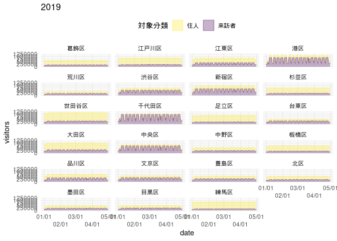

<!-- README.md is generated from README.Rmd. Please edit that file -->

# ヤフー・データソリューションの「東京23区滞在人口推計値の日別遷移（全体・来訪者・住人）」をRでプロットしてみる

## データの出典

  - 東京23区滞在人口推計値の日別遷移データ: ヤフー・データソリューション
    (<https://ds.yahoo.co.jp/report/>)
  - 行政区域データ: 国土数値情報
    (<http://nlftp.mlit.go.jp/ksj/gml/datalist/KsjTmplt-N03-v2_3.html>)
  - 祝日データ: zipangu (<https://uribo.github.io/zipangu/>)

## Plot

``` r
library(readr)
library(ggplot2)
library(sf)
#> Linking to GEOS 3.8.0, GDAL 3.0.4, PROJ 6.3.1
library(dplyr, warn.conflicts = FALSE)
```

``` r
# 前処理の詳細は scripts/get_data.R
d <- readr::read_csv(here::here("data/data.csv"))
#> Parsed with column specification:
#> cols(
#>   エリア = col_character(),
#>   対象分類 = col_character(),
#>   date = col_date(format = ""),
#>   visitors = col_double()
#> )
```

``` r
ggplot(d, aes(date, visitors, colour = 対象分類, fill = 対象分類)) +
  geom_area() +
  facet_wrap(vars(エリア), ncol = 4) +
  scale_colour_viridis_d(alpha = 0.3, aesthetics = c("colour", "fill")) +
  scale_x_date(guide = guide_axis(n.dodge = 2), date_labels = "%m/%d") +
  theme_minimal() +
  theme(legend.position = "top")
```

<!-- -->

``` r
# 前処理の詳細は scripts/get_tokyo_gpkg.R
tokyo <- read_sf(here::here("data/tokyo.gpkg"))

d2 <- d %>%
  mutate(
    is_holiday = zipangu::is_jholiday(date) | (lubridate::wday(date) %in% c(1, 7)),
    is_holiday = factor(if_else(is_holiday, "休日", "平日"), levels = c("平日", "休日")),
    # 土日は連続させたいので、月曜始まりにする
    week_begin = lubridate::floor_date(date, "weeks", week_start = 1),
    day = lubridate::wday(date, label = TRUE, week_start = 1)
  ) %>% 
  inner_join(tokyo, ., by = c("市区町村名" = "エリア"))
```

とりあえず1週間分プロットしてみる。

``` r
d2 %>%
  filter(week_begin == as.Date("2020-02-03")) %>% 
  ggplot() +
  geom_sf(aes(fill = visitors), colour = NA) +
  facet_grid(rows = vars(対象分類), cols = vars(day)) +
  theme_minimal() +
  theme(legend.position = "top") +
  scale_fill_viridis_c(option = "B") +
  ggtitle("2020/2/3〜2/9")
```

<!-- -->

休日と平日で傾向が違うので、別々に変化を見る。

``` r
# 2020年2月の区別・休/平日別の平均人口を基準とする
d_feb <- d2 %>% 
  sf::st_set_geometry(NULL) %>% 
  filter(lubridate::month(date) == 2) %>%
  group_by(市区町村名, 対象分類, is_holiday) %>% 
  summarise(visitors_feb = mean(visitors))

d_weekly <- d2 %>%
  # 3月以降
  filter(lubridate::month(week_begin) > 2) %>%
  group_by(市区町村名, 対象分類, is_holiday, week_begin) %>%
  summarise(visitors = mean(visitors)) %>%
  ungroup() %>%
  inner_join(d_feb, by = c("市区町村名", "対象分類", "is_holiday")) %>% 
  mutate(
    visitors_lift = visitors / visitors_feb - 1
  )

ggplot(d_weekly, aes(week_begin, visitors_lift, colour = 市区町村名)) +
  geom_line() +
  geom_point() +
  facet_grid(rows = vars(is_holiday, 対象分類)) +
  scale_colour_viridis_d(option = "B", alpha = 0.7) +
  scale_x_date(date_breaks = "weeks") +
  scale_y_continuous("変化", labels = scales::percent) +
  theme_minimal() +
  labs(title = "2020年3月以降の滞在人口の変化", subtitle = "※2020年2月の区別・休/平日別の平均人口を基準とする")
```

<!-- -->

住民は無視しても良さそうなので、来訪者のみの変化を見る

``` r
d_weekly_de_facto <- d_weekly %>% 
  filter(対象分類 == "来訪者") %>% 
  mutate(week_id = group_indices(., week_begin))

ggplot(d_weekly_de_facto) +
  geom_sf(aes(fill = visitors_lift), colour = NA) +
  facet_grid(cols = vars(is_holiday), rows = vars(week_begin)) +
  theme_minimal() +
  scale_fill_gradient2("変化", labels = scales::percent) +
  labs(title = "2020年3月以降の滞在人口の変化", subtitle = "※2020年2月の区別・休/平日別の平均人口を基準とする", 
       caption = "データの出典:ヤフー・データソリューション, 国土交通省　国土数値情報（行政区域データ）")
```

<!-- -->
